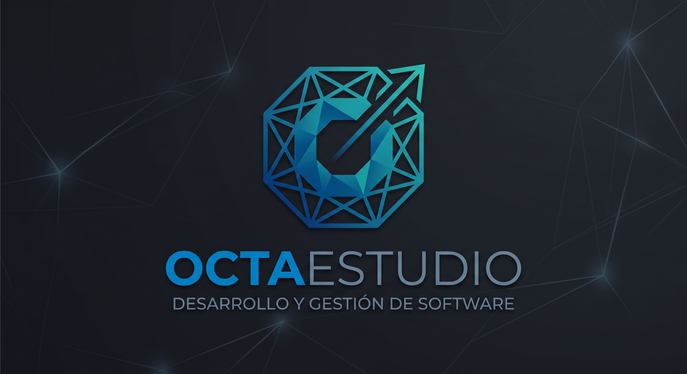

  <strong>Sergio · Ingeniero en Desarrollo y Gestión de Software</strong> 
  Aplicaciones para Windows, herramientas multimedia y proyectos de datos.

  <a href="https://github.com/Sergio5331/OctaStudio">OctaStudio</a>
  &nbsp; · &nbsp;
  <a href="https://github.com/Sergio5331/Universal-Media-Downloader">Universal Media Downloader</a>
  &nbsp; · &nbsp;
  <a href="https://github.com/Sergio5331?tab=repositories">Todos mis proyectos</a>

## Hola, soy Sergio

Soy **ingeniero en Desarrollo y Gestión de Software** y este es el espacio de **OCTAESTUDIO**, mi estudio de desarrollo de software.

Desarrollo herramientas para facilitar la edición de contenido y el trabajo con archivos multimedia. Aquí comparto mis proyectos, sus avances y versiones de prueba, además de proyectos de integración y análisis de datos.

## Proyectos destacados

### OctaStudio · Editor de video y audio

Una aplicación para **Windows 10/11 de 64 bits** que reúne edición de video, audio y subtítulos.

- Línea de tiempo con recortes, filtros y efectos.
- Textos e imágenes superpuestos, estilos y animaciones.
- Subtítulos automáticos con reconocimiento de voz local.
- Ajuste de volumen por lotes con protección de picos.
- Exportación de video y audio e instalador para Windows.

[**Ver proyecto →**](https://github.com/Sergio5331/OctaStudio) · [Descargar beta 1.1.0](https://github.com/Sergio5331/OctaStudio/releases/tag/v1.1.0-beta.1) · [Reportar un error](https://github.com/Sergio5331/OctaStudio/issues)

### Universal Media Downloader · Descargas de video y audio

Herramienta para **Windows de 64 bits** con descargas individuales, colas por lotes y listas de reproducción.

- Análisis de enlaces y selección de calidad disponible.
- Descargas por lotes y organización de playlists en carpetas.
- Extracción de audio MP3 a 128, 192 o 320 kbps.
- Opciones de portada y metadatos, y selección de carpeta de destino.

[**Ver proyecto →**](https://github.com/Sergio5331/Universal-Media-Downloader) · [Descargar beta 1.0.0](https://github.com/Sergio5331/Universal-Media-Downloader/releases/tag/v1.0.0-beta.1) · [Reportar un error](https://github.com/Sergio5331/Universal-Media-Downloader/issues)

> **Aplicaciones en fase beta.** Ambas herramientas siguen en desarrollo. Los comentarios y reportes de errores ayudan a mejorar las próximas versiones.

### Data Warehouse · Rendimiento académico

Proyecto académico de integración de datos para analizar el rendimiento universitario. Incluye un proceso **ETL**, limpieza de datos y un modelo dimensional en estrella, con Excel, Power Query y MySQL.

[**Explorar el proyecto →**](https://github.com/Sergio5331/DW_Universidad)

## Tecnologías presentes en mis proyectos

| Desarrollo de aplicaciones | Multimedia y automatización | Datos |
| :--- | :--- | :--- |
| Python · JavaScript · HTML · CSS | FFmpeg · PowerShell · yt-dlp | MySQL · Excel · Power Query |

## En qué estoy trabajando

- Mejorar la experiencia de edición de OctaStudio.
- Probar los instaladores y el funcionamiento de las aplicaciones en Windows.
- Corregir errores y ampliar las herramientas a partir de los comentarios de quienes las prueban.

---

  <strong>OCTAESTUDIO</strong> 
  Desarrollo y Gestión de Software  
  ¿Tienes una sugerencia o encontraste un error? Abre un <em>issue</em> en el proyecto correspondiente.

